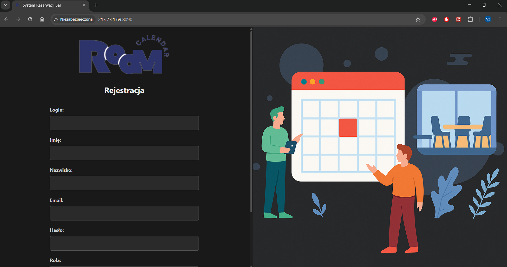
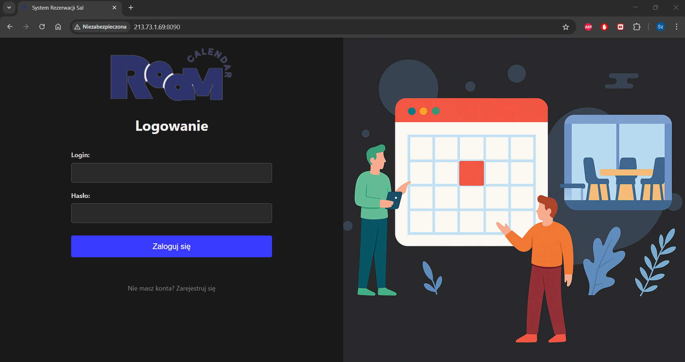
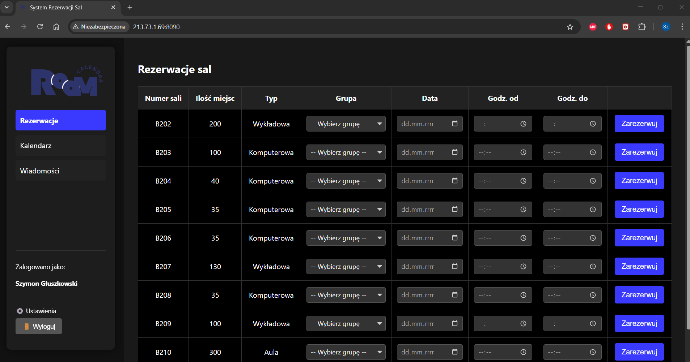
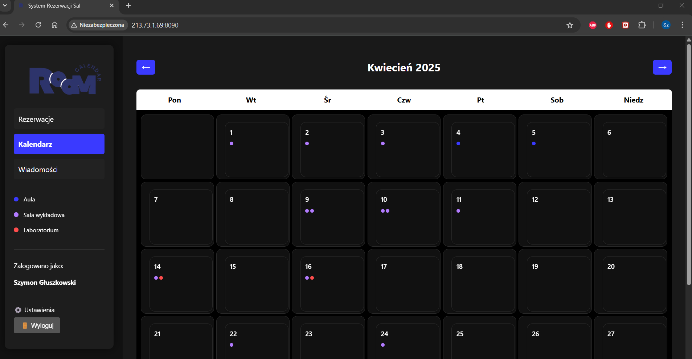
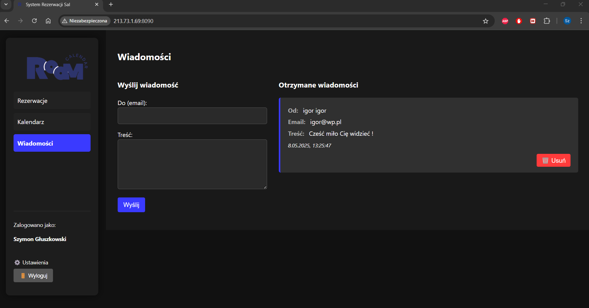

# System rezerwacji sal wykładowych

## Cel wdrożenia projektu
Aplikacja tworzona jest na potrzeby przedmiotu Zawansowane aplikacje internetowe. 
## Opis systemu
System rezerwacji sal wykładowych to aplikacja internetowa umożliwiająca zarządzanie salami, organizowanie harmonogramu zajęć oraz powiadamianie użytkowników o nadchodzących rezerwacjach. System zapewnia również obsługę rejestracji i logowania użytkowników.
## Cele systemu
+ Umożliwienie rezerwacji sal wykładowych przez wykładowców.
+ Zarządzanie dostępnością sal oraz kalendarzem.
+ Wysyłanie powiadomień o zbliżających się rezerwacjach. (W trakcie implementacji)
+ Zabezpieczenie dostępu poprzez system logowania i rejestracji.
## Użytkownicy systemu
+ Administrator: zarządza systemem, dodaje/usuwa sale, edytuje harmonogram.
+ Wykładowca: rezerwuje sale na wykłady i inne wydarzenia.
+ Student: przegląda dostępne sale oraz harmonogram zajęć.
## Funkcjonalności
### Moduł zarządzania użytkownikami
+ Rejestracja i logowanie użytkowników.
+ Role użytkowników (administrator, wykładowca, student).
+ Możliwość zarządzania kontami użytkowników przez administratora.
### Moduł rezerwacji
+ Możliwość rezerwacji sal w oparciu o dostępne terminy.
+ Sprawdzenie dostępności sali w kalendarzu.
+ Anulowanie i edytowanie rezerwacji.
+ Historia rezerwacji.
### Kalendarz
+ Widok miesięczny.
+ Integracja z rezerwacjami.
+ Kolorowe oznaczenia typów sal.
### Powiadomienia i wiadomości
+ Wysyłanie powiadomień e-mailowych o rezerwacjach.
+ Powiadomienia o nadchodzących zajęciach.
+ Opcjonalne powiadomienia push.
### Zarządzanie salami
+ Dodawanie i edytowanie sal (pojemność, wyposażenie, lokalizacja).
+ Blokowanie sal na określony czas.
### Wiadomości
+ Wysyłanie wiadomości do innych użytkowników systemu 
+ Powiadomienia o nowych wiadomościach 
## Technologie
Frontend
 + HTML
 + Style.css - niestandardowe style w ciemnym motywie, responsywny układ.
 + Javascript - dynamiczne UI, logika aplikacji, integracja z backendem.

Backend
 + Node.js - serwer aplikacji, obsługa API i sesji użytkowników.
 + MySQL - relacyjna baza danych.
## Architektura systemu
+ Frontend: JavaScript
+ Backend: NestJS (Node.js)
+ Baza danych: MySQL
## Przypadki użycia (Use Case)

Use Case 1: Rezerwacja sali przez wykładowcę 
Aktor: Wykładowca  
Opis: Wykładowca loguje się do systemu, wybiera odpowiednią salę i dostępny termin, a następnie potwierdza rezerwację. System zapisuje rezerwację i wysyła powiadomienie.

----------------------------------

Use Case 2: Przeglądanie dostępnych sal przez studenta  
Aktor: Student  
Opis: Student loguje się do systemu, przegląda kalendarz i dostępność sal. W kalendarzu wyświetlane są tylko rezerwacji grupy do której zapisany jest student.

----------------------------------

Use Case 3: Automatyczne powiadomienie o rezerwacji 
Aktor: System 
Opis: Po dokonaniu rezerwacji system automatycznie wysyła powiadomienie e-mailowe do użytkownika o potwierdzeniu rezerwacji oraz przypomnienie na dzień przed wydarzeniem.

----------------------------------

Use Case 4: Wysyłanie wiadomości do innych użytkowników 
Aktor: Student/Wykładowca  
Opis: Aktor przechodzi w zakładke wiadomości, wprowadza email użytkownika do którego chce wysłać wiadomość. System po wpisaniu drugiej litry automatycznie podpowiada emaile, które znajdują się w bazie. Następnie użytkownik wprowadza treść wiadomości.
## Wizualizacja aplikacji 
### Wygląd strony rejestracji

----------------------------------
### Wygląd strony logowania

----------------------------------
### Wygląd strony rezerwacji

----------------------------------
### Wygląd strony kalendarza

----------------------------------
### Wygląd strony wiadomości

----------------------------------

## Przypadki Testowe Manualne 

**Legenda Statusów:**
* **Pass:** Test zakończony sukcesem.
* **Fail:** Test zakończony niepowodzeniem.
* **Blocked:** Nie można wykonać testu.
---

### Moduł 1: Autentykacja (Logowanie, Rejestracja, Sesja)

| ID Testu    | Tytuł Testu                                          | Kroki Testowe                                                                                                                                                                                                                                                                                       | Oczekiwany Rezultat                                                                                                                                                               | Aktualny Rezultat                                                                                                   | Status | Uwagi          |
| :---------- | :--------------------------------------------------- | :-------------------------------------------------------------------------------------------------------------------------------------------------------------------------------------------------------------------------------------------------------------------------------------------------- | :-------------------------------------------------------------------------------------------------------------------------------------------------------------------------------- | :------------------------------------------------------------------------------------------------------------------ | :----- | :------------- |
| **TC-AUTH-01** | Rejestracja - Sukces (Student)                      | 1. Otwórz stronę logowania. 2. Kliknij "Zarejestruj się". 3. Wypełnij poprawnie wszystkie pola (w tym wymagane dla studenta: nr indeksu, grupa, kierunek), wybierz rolę "Student". 4. Kliknij "Zarejestruj się".                                                                                     | 1. Wyświetla się komunikat o sukcesie rejestracji. 2. Użytkownik zostaje w widoku logowania (lub jest automatycznie przekierowywany). 3. Nowy użytkownik i student pojawiają się w bazie danych z poprawnymi danymi (sprawdź w DB). | Zgodnie z oczekiwaniem. Wyświetlono sukces, użytkownik dodany do bazy i przeniesiony do logowania.                                               | Pass   |                |
| **TC-AUTH-02** | Rejestracja - Sukces (Wykładowca)                   | 1. Otwórz stronę logowania. 2. Kliknij "Zarejestruj się". 3. Wypełnij poprawnie wszystkie pola (tytuł naukowy opcjonalnie), wybierz rolę "Wykładowca". 4. Kliknij "Zarejestruj się".                                                                                                                | 1. Wyświetla się komunikat o sukcesie rejestracji. 2. Użytkownik zostaje w widoku logowania. 3. Nowy użytkownik i wykładowca pojawiają się w bazie danych (sprawdź w DB).            | Zgodnie z oczekiwaniem. Wyświetlono sukces, użytkownik dodany do bazy i przenisiony do logowania.                                               | Pass   |                |
| **TC-AUTH-03** | Rejestracja - Błąd (Login istnieje)                 | 1. Otwórz rejestrację. 2. Wprowadź dane, ale użyj loginu, który **już istnieje** w bazie. 3. Kliknij "Zarejestruj się".                                                                                                                                                                             | Wyświetla się komunikat błędu informujący, że login jest zajęty. Użytkownik nie zostaje dodany do bazy.                                                                             | Zgodnie z oczekiwaniem. Wyświetlono błąd "Użytkownik o podanym loginie lub adresie email już istnieje".                                                              | Pass   |                |
| **TC-AUTH-04** | Rejestracja - Błąd (Email istnieje)                 | 1. Otwórz rejestrację. 2. Wprowadź dane, ale użyj adresu email, który **już istnieje** w bazie. 3. Kliknij "Zarejestruj się".                                                                                                                                                                    | Wyświetla się komunikat błędu informujący, że email jest zajęty. Użytkownik nie zostaje dodany do bazy.                                                                            | Zgodnie z oczekiwaniem. Wyświetlono błąd "Użytkownik o podanym loginie lub adresie email już istnieje".                                                              | Pass   |                |
| **TC-AUTH-05** | Rejestracja - Błąd (Braki w danych)                 | 1. Otwórz rejestrację. 2. Spróbuj wysłać formularz z pustymi wymaganymi polami (np. bez loginu, hasła, imienia, nazwiska, emaila, roli; bez pól studenta jeśli wybrano studenta). 3. Kliknij "Zarejestruj się".                                                                                   | Wyświetla się komunikat błędu informujący o konieczności wypełnienia wymaganych pól. Rejestracja nie przechodzi.                                                                   | Zgodnie z oczekiwaniem. Wyświetlono błąd "Wypełnij to pole".                                                        | Pass   |                |
| **TC-AUTH-06** | Logowanie - Sukces (Student)                      | 1. Użyj danych studenta zarejestrowanego w TC-AUTH-01. 2. Wprowadź poprawny login i hasło. 3. Kliknij "Zaloguj się".                                                                                                                                                                           | 1. Użytkownik zostaje zalogowany. 2. Widok logowania znika, pojawia się dashboard. 3. W sidebarze widać dane użytkownika. 4. Zakładka "Rezerwacje" jest ukryta. Domyślny widok to Kalendarz. | Zgodnie z oczekiwaniem. Student zalogowany, widok poprawny.                                                            | Pass   |                |
| **TC-AUTH-07** | Logowanie - Sukces (Wykładowca)                   | 1. Użyj danych wykładowcy zarejestrowanego w TC-AUTH-02. 2. Wprowadź poprawny login i hasło. 3. Kliknij "Zaloguj się".                                                                                                                                                                       | 1. Użytkownik zostaje zalogowany. 2. Widok logowania znika, pojawia się dashboard. 3. W sidebarze widać dane użytkownika. 4. Zakładka "Rezerwacje" jest widoczna. Domyślny widok to Rezerwacje. | Zgodnie z oczekiwaniem. Wykładowca zalogowany, widok poprawny.                                                         | Pass   |                |
| **TC-AUTH-08** | Logowanie - Błąd (Złe hasło)                      | 1. Użyj istniejącego loginu. 2. Wprowadź **niepoprawne** hasło. 3. Kliknij "Zaloguj się".                                                                                                                                                                                                  | Wyświetla się komunikat o błędnym loginie lub haśle. Użytkownik pozostaje w widoku logowania.                                                                                        | Zgodnie z oczekiwaniem. Wyświetlono błąd "Nieprawidłowy login lub hasło".                                                                           | Pass   |                |
| **TC-AUTH-09** | Logowanie - Błąd (Zły login)                       | 1. Wprowadź **nieistniejący** login. 2. Wprowadź dowolne hasło. 3. Kliknij "Zaloguj się".                                                                                                                                                                                                   | Wyświetla się komunikat o błędnym loginie lub haśle. Użytkownik pozostaje w widoku logowania.                                                                                        | Zgodnie z oczekiwaniem. Wyświetlono błąd "Nieprawidłowy login lub hasło".                                                                           | Pass   |                |
| **TC-AUTH-10** | Wylogowanie                                        | 1. Będąc zalogowanym, kliknij przycisk "Wyloguj".                                                                                                                                                                                                                                         | 1. Użytkownik zostaje wylogowany. 2. Pojawia się widok logowania. 3. Dashboard znika.                                                                                            | Zgodnie z oczekiwaniem. Pomyślnie wylogowano.                                                                         | Pass   |Pola login i hasło pozostają uzupełmnione.|
| **TC-AUTH-11** | Sesja - Odświeżenie strony                        | 1. Zaloguj się. 2. Odśwież stronę w przeglądarce (F5 / Ctrl+R).                                                                                                                                                                                                                         | Użytkownik pozostaje zalogowany, widoczny jest dashboard.                                                                                                                        | Zgodnie z oczekiwaniem. Sesja utrzymana.                                                                            | Pass   |                |

---

### Moduł 2: Autoryzacja (Uprawnienia Ról)

| ID Testu      | Tytuł Testu                                       | Kroki Testowe                                                                                                                                                  | Oczekiwany Rezultat                                                                                                                              | Aktualny Rezultat                                                                  | Status | Uwagi          |
| :------------ | :------------------------------------------------ | :------------------------------------------------------------------------------------------------------------------------------------------------------------- | :----------------------------------------------------------------------------------------------------------------------------------------------- | :--------------------------------------------------------------------------------- | :----- | :------------- |
| **TC-AUTHZ-01** | Dostęp Studenta - Widok Rezerwacje               | 1. Zaloguj się jako student. 2. Sprawdź, czy w sidebarze widoczna jest zakładka "Rezerwacje". 3. Spróbuj (jeśli to możliwe) wymusić przejście do widoku rezerwacji. | Zakładka "Rezerwacje" w sidebarze jest niewidoczna lub nieaktywna. Widok listy sal do rezerwacji nie jest dostępny dla studenta.                      | Zgodnie z oczekiwaniem. Zakładka niewidoczna.                                       | Pass   |                |
| **TC-AUTHZ-02** | Dostęp Wykładowcy - Widok Rezerwacje              | 1. Zaloguj się jako wykładowca. 2. Sprawdź, czy w sidebarze widoczna i aktywna jest zakładka "Rezerwacje". 3. Kliknij zakładkę "Rezerwacje".                     | Zakładka jest widoczna. Po kliknięciu wyświetla się widok z tabelą sal do rezerwacji, zawierający pola do wpisania danych i przyciski "Zarezerwuj". | Zgodnie z oczekiwaniem. Zakładka widoczna, widok tabeli poprawny.                  | Pass   |                |
| **TC-AUTHZ-03** | Dostęp Studenta - Modal Szczegółów Dnia           | 1. Zaloguj się jako student. 2. Przejdź do kalendarza. 3. Kliknij na dzień, w którym są rezerwacje **jego grupy** .                   | Modal się otwiera. Widoczne są rezerwacje TYLKO dla grupy studenta.                             | Zgodnie z oczekiwaniem. Modal pokazuje tylko rezerwacje grupy studenta.            | Pass   | |
| **TC-AUTHZ-04** | Dostęp Wykładowcy - Modal Szczegółów Dnia          | 1. Zaloguj się jako wykładowca. 2. Przejdź do kalendarza. 3. Kliknij na dzień, w którym są rezerwacje różnych grup, w tym dokonane przez wykładowcę z tytułem. | Modal się otwiera. Widoczne są **wszystkie** rezerwacje na dany dzień.| Zgodnie z oczekiwaniem. Modal pokazuje wszystkie rezerwacje.        | Pass   |                |

---

### Moduł 3: Rezerwacja Sali (rola: Wykładowca)

| ID Testu    | Tytuł Testu                           | Kroki Testowe                                                                                                                                                                                          | Oczekiwany Rezultat                                                                                                                                                               | Aktualny Rezultat                                                                  | Status | Uwagi          |
| :---------- | :------------------------------------ | :----------------------------------------------------------------------------------------------------------------------------------------------------------------------------------------------------- | :-------------------------------------------------------------------------------------------------------------------------------------------------------------------------------- | :--------------------------------------------------------------------------------- | :----- | :------------- |
| **TC-BOOK-01** | Wyświetlenie listy sal               | 1. Zaloguj się jako wykładowca. 2. Przejdź do widoku "Rezerwacje".                                                                                                                                   | Tabela wypełnia się listą sal z bazy danych. Widoczne są wszystkie kolumny, w tym pola do wpisania danych.                                                                       | Zgodnie z oczekiwaniem. Sale załadowane.                                             | Pass   |                |
| **TC-BOOK-02** | Wypełnienie listy grup              | 1. Zaloguj się jako wykładowca. 2. Przejdź do widoku "Rezerwacje". 3. Kliknij na listę rozwijaną w kolumnie "Grupa".                                                                                     | Lista rozwijana zawiera grupy studentów pobrane z bazy danych (posortowane alfabetycznie). Jest też opcja "-- Wybierz grupę --".                                                    | Zgodnie z oczekiwaniem. Lista grup załadowana.                                     | Pass   |                |
| **TC-BOOK-03** | Rezerwacja - Sukces (Wolny termin) | 1. Jako wykładowca, wybierz salę. 2. Wybierz grupę z listy. 3. Wybierz datę i godziny, które są na pewno **wolne** dla tej sali. 4. Upewnij się, że godzina 'do' jest późniejsza niż 'od'. 5. Kliknij "Zarezerwuj". | 1. Pojawia się modal powiadomienia o sukcesie. 2. Pola formularza w tym wierszu czyszczą się. 3. W kalendarzu (po odświeżeniu) pojawia się kropka dla tej rezerwacji. 4. W bazie danych pojawia się nowy wpis. | Zgodnie z oczekiwaniem. Rezerwacja dodana, powiadomienie pokazane, kropka w kalendarzu. | Pass   | Wymaga znalezienia wolnego slotu |
| **TC-BOOK-04** | Rezerwacja - Błąd (Konflikt czasu)  | 1. Jako wykładowca, wybierz salę, grupę, datę. 2. Wprowadź godziny, które **dokładnie pokrywają się** lub **nakładają** na istniejącą rezerwację dla tej sali w tym dniu. 3. Kliknij "Zarezerwuj". | Pojawia się modal powiadomienia o błędzie (konflikt terminów). Rezerwacja nie zostaje dodana do bazy.                                                                            | Zgodnie z oczekiwianiami. Rezerwacja nie zostaje dodana do bazy zwrócono komunikat o błędzie.                                | Pass   | Wymaga istniejącej rezerwacji, naprawiony błąd wyświetlania komunikatu z pokrywającymi się godzinami zajęć |
| **TC-BOOK-05** | Rezerwacja - Błąd (Nie wybrano grupy) | 1. Jako wykładowca, wybierz salę, datę, godziny. 2. **Nie wybieraj** grupy (zostaw "-- Wybierz grupę --"). 3. Kliknij "Zarezerwuj".                                                                 | Pojawia się komunikat błędu (w modalu lub pod tabelą) o konieczności wybrania grupy. Rezerwacja nie jest dodawana.                                                              | Zgodnie z oczekiwaniami. Rezerwacja nie zostaje dodana zwrócono komunikat o błędzie.                              |Pass   | Naprawiony błąd wyświetlania komunikatu nie wybrania grupy              |
| **TC-BOOK-06** | Rezerwacja - Błąd (Brak daty/godzin) | 1. Jako wykładowca, wybierz salę i grupę. 2. Pozostaw puste pole daty lub którejś godziny. 3. Kliknij "Zarezerwuj".                                                                               | Pojawia się komunikat błędu (w modalu lub pod tabelą) o konieczności wypełnienia wszystkich pól. Rezerwacja nie jest dodawana.                                                      | Zgodnie z oczekiwaniem. Rezerwacja nie została dodana  zwrócono komunikat o błędzie.                             |Pass   | Naprawiony błąd wyświetlania komunikatu pozostawienia pustych pól daty lub godziny               |
| **TC-BOOK-07** | Rezerwacja - Błąd (Złe godziny)     | 1. Jako wykładowca, wybierz salę, grupę, datę. 2. Wprowadź godzinę 'do' taką samą lub wcześniejszą niż godzina 'od'. 3. Kliknij "Zarezerwuj".                                                         | Pojawia się komunikat błędu (w modalu lub pod tabelą) o nieprawidłowym zakresie godzin. Rezerwacja nie jest dodawana.                                                              | Zgodnie z oczekiwaniem. Rezerwacja nie została dodana zwrócono komunikat o błędzie                            |Pass   | Naprawiony błąd wyświetlania komunikatu o godzinie zakończenia wcześniejszej niż rozpoczęcia               |

---

### Moduł 4: Widok Kalendarza i Modal Szczegółów

| ID Testu     | Tytuł Testu                             | Kroki Testowe                                                                                                         | Oczekiwany Rezultat                                                                                              | Aktualny Rezultat                                                    | Status | Uwagi |
| :----------- | :-------------------------------------- | :-------------------------------------------------------------------------------------------------------------------- | :--------------------------------------------------------------------------------------------------------------- | :------------------------------------------------------------------- | :----- | :---- |
| **TC-CAL-01** | Wyświetlanie kalendarza               | 1. Zaloguj się. 2. Przejdź do widoku "Kalendarz".                                                                   | Wyświetla się siatka kalendarza z poprawnym miesiącem, rokiem i dniami tygodnia. Dzisiejszy dzień jest podświetlony. | Zgodnie z oczekiwaniem.                                                | Pass   |       |
| **TC-CAL-02** | Nawigacja - Poprzedni miesiąc        | 1. W widoku kalendarza kliknij strzałkę w lewo (`<`).                                                               | Wyświetla się poprzedni miesiąc (o ile jest to dozwolone, np. nie przed początkiem zakresu).                       | Zgodnie z oczekiwaniem.                                                | Pass   |       |
| **TC-CAL-03** | Nawigacja - Następny miesiąc         | 1. W widoku kalendarza kliknij strzałkę w prawo (`>`).                                                               | Wyświetla się następny miesiąc (o ile jest to dozwolone).                                                         | Zgodnie z oczekiwaniem.                                                | Pass   |       |
| **TC-CAL-04** | Wyświetlanie kropek rezerwacji       | 1. Upewnij się, że w bazie istnieje rezerwacja na konkretny dzień. 2. Przejdź do widoku kalendarza na odpowiedni miesiąc. | W komórce odpowiadającej dniu rezerwacji widoczna jest kropka w kolorze odpowiadającym typowi sali.             | Zgodnie z oczekiwaniem. Kropki widoczne.                               | Pass   |       |
| **TC-MODAL-01** | Otwieranie modala                     | 1. W widoku kalendarza kliknij na komórkę dnia (nie pustą na początku miesiąca).                                    | Otwiera się okno modalne "Szczegóły Rezerwacji".                                                                  | Zgodnie z oczekiwaniem. Modal się otwiera.                             | Pass   |       |
| **TC-MODAL-02** | Wyświetlanie daty w modalu           | 1. Kliknij na konkretny dzień (np. 15 marca 2025).                                                                  | W tytule modala wyświetla się poprawna data (np. "2025-03-15").                                                   | Zgodnie z oczekiwaniem. Data poprawna.                                 | Pass   |       |
| **TC-MODAL-03** | Wyświetlanie rezerwacji w modalu     | 1. Kliknij na dzień z jedną lub wieloma znanymi rezerwacjami.                                                        | W modalu wyświetla się poprawna lista rezerwacji z prawidłowymi danymi (sala, godziny, grupa, typ, rezerwujący).    | Zgodnie z oczekiwaniem. Lista rezerwacji poprawna.                   | Pass   |       |
| **TC-MODAL-04** | Wyświetlanie braku rezerwacji        | 1. Kliknij na dzień, w którym na pewno nie ma żadnych rezerwacji (dla danej roli).                                   | W modalu wyświetla się komunikat "Brak rezerwacji na ten dzień".                                                  | Zgodnie z oczekiwaniem. Poprawny komunikat.                           | Pass   |       |
| **TC-MODAL-05** | Zamykanie modala (Przycisk X)       | 1. Otwórz modal. 2. Kliknij przycisk `X` w rogu modala.                                                               | Modal zostaje zamknięty.                                                                                         | Zgodnie z oczekiwaniem. Modal zamknięty.                               | Pass   |       |
| **TC-MODAL-06** | Zamykanie modala (Kliknięcie tła) | 1. Otwórz modal. 2. Kliknij na przyciemnione tło **poza** obszarem zawartości modala.                                  | Modal zostaje zamknięty.                                                                                         | Zgodnie z oczekiwaniem. Modal zamknięty.                               | Pass   |       |

---

### Moduł 5: Ogólne (UI/UX, Inne)

| ID Testu   | Tytuł Testu                 | Kroki Testowe                                                                 | Oczekiwany Rezultat                                                                | Aktualny Rezultat                             | Status | Uwagi          |
| :--------- | :-------------------------- | :---------------------------------------------------------------------------- | :--------------------------------------------------------------------------------- | :-------------------------------------------- | :----- | :------------- |
| **TC-UI-01** | Favicon                     | 1. Sprawdź ikonkę na karcie przeglądarki.                                     | Widoczna jest poprawna ikonka favicon (np. logo).                                    | Zgodnie z oczekiwaniem. Favicon widoczny.     | Pass   |   |
| **TC-UI-02** | Styl pól w tabeli           | 1. Zaloguj się jako wykładowca, przejdź do "Rezerwacje". 2. Sprawdź wygląd pól. | Pola `select`, `date`, `time` w tabeli mają ciemne tło i jasny tekst, pasujący do motywu. | Zgodnie z oczekiwaniem. Pola ostylowane.    | Pass   |  |
| **TC-UI-03** | Scrollbar w panelu logowania | 1. Przejdź do widoku rejestracji. 2. Wybierz rolę, aby pojawiły się dodatkowe pola. | Jeśli formularz jest dłuższy niż panel, pojawia się wewnętrzny pasek przewijania w panelu formularza, ostylowany zgodnie z motywem. Strona się nie scrolluje. | Zgodnie z oczekiwaniem. Scrollbar wewnętrzny działa. | Pass   |                |

---
### Testy Postman

| Nr | Endpoint                            | Metoda | Adres URL                                            | Body                                                                                     | Wynik                                                                                    |
| -- | ------------------------------------| ------ | ---------------------------------------------------- | -----------------------------------------------------------------------------------------| ---------------------------------------------------------------------------------------- |
| 1  | Logowanie                           | POST   | `http://213.73.1.69:3000/login`                      | `{ "login": "szymong", "haslo": "12345" }`                                               | `{ "success": true, "message": "Zalogowano pomyślnie.", "user": { ... } }`               |
| 2  | Rejestracja                         | POST   | `http://213.73.1.69:3000/register`                   | `{ "login": "testwykladowca123", "imie": "Andrzej", ... }`                               | `{ "success": true, "message": "Rejestracja zakończona pomyślnie." }`                    |
| 3  | Wylogowanie                         | GET    | `http://213.73.1.69:3000/logout`                     | —                                                                                        | `{ "success": true, "message": "Wylogowano pomyślnie." }`                                |
| 4  | Sprawdzenie sesji                   | GET    | `http://213.73.1.69:3000/check-session`              | —                                                                                        | `{ "isLoggedIn": false }`                                                                |
| 5  | Lista sal                           | GET    | `http://213.73.1.69:3000/sale`                       | —                                                                                        | `[ { "nr_sali": "B202", "ilosc_miejsc": 200, "typ": "Wykładowa" }, ... ]`                |
| 6  | Lista grup                          | GET    | `http://213.73.1.69:3000/grupy`                      | —                                                                                        | `[ "INIS5", "INIS6", "ZWIZ2" ]`                                                          |
| 7  | Rezerwacja sali                     | POST   | `http://213.73.1.69:3000/rezerwacje`                 | `{ "nr_sali": "B202", "grupa": "INIS5", ... }`                                           | `{ "success": true, "id": 48 }`                                                          |
| 8  | Rezerwacje na konkretny dzień       | GET    | `http://213.73.1.69:3000/rezerwacje/data/2025-05-10` | —                                                                                        | `[ { "nr_sali": "B202", "grupa": "INIS5", "termin": "2025-05-10T00:00:00.000Z", ... } ]` |
| 9  | Wszystkie rezerwacje                | GET    | `http://213.73.1.69:3000/rezerwacje`                 | —                                                                                        | `[ { "id": 28, "nr_sali": "B202", "grupa": "INIS6", ... }, ... ]`                        |
| 10 | Wiadomość                           | POST   | `http://213.73.1.69:3000/wiadomosci`                 | `{ "email": "igor@wp.pl", "tresc": "Dzień dobry, proszę o informację w sprawie sali." }` | `{ "success": true, "message": "Wiadomość została wysłana." }`                                                                                                                                                                                                                                                                                                         |
| 11 | Wiadomości                          | GET    | `http://213.73.1.69:3000/wiadomosci`                 | —                                                                                        | `[ { "id": 41, "imie": "Szymon", "nazwisko": "Głuszkowski", "nadawca_email": "szymon02g@wp.pl", "tresc": "Ble bleble", "data_wyslania": "2025-05-08T18:35:47.000Z", "is_read": 1 }, { "id": 39, "imie": "igor", "nazwisko": "igor", "nadawca_email": "igor@wp.pl", "tresc": "Cześć miło Cię widzieć !", "data_wyslania": "2025-05-08T11:25:47.000Z", "is_read": 1 } ]` |
| 12 | Wiadomość (Usunięcie)               | DELETE | `http://213.73.1.69:3000/wiadomosci/39`              | —                                                                                        | `{ "success": true, "message": "Wiadomość została usunięta." }`                                                                                                                                                                                                                                                                                                        |
| 13 | Status nieprzeczytanych wiadomości  | GET    | `http://213.73.1.69:3000/api/unread-status`          | —                                                                                        | `{ "hasUnread": false }`                                                                                                                                                                                                                                                                                                                                               |
| 14 | Oznacz jako przeczytane             | POST   | `http://213.73.1.69:3000/api/mark-read`              | —                                                                                        | `204 No Content`                                                                                                                                                                                                                                                                                                                                                       |
| 15 | Podpowiedzi emaili                  | GET    | `http://213.73.1.69:3000/users/emails?query=szym`    | —                                                                                        | `[ "szymon02g@wp.pl" ]`                                                                                                                                                                                                                                                                                                                                                |

---
### Testy Jednostkowe i e2e dodane
---
## Licencja
----------------------------------
## Podsumowanie
System rezerwacji sal wykładowych zapewni wygodny sposób na organizowanie zajęć oraz zarządzanie dostępnością sal. Dzięki nowoczesnym technologiom aplikacja będzie szybka, przystępna i łatwa w obsłudze.
